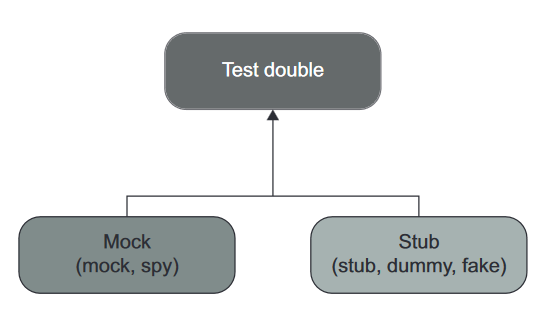
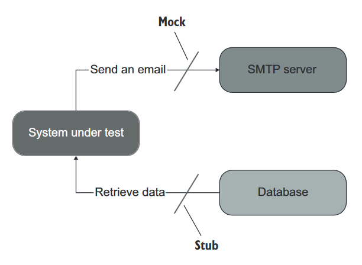

Chapter 5. Mock과 테스트 취약성

> 커맨드로 테스트를 직접 실행하기 위해선 현재 디렉토리로 이동한다.
>   `cd pt2/ch05`

---

# 들어가며

테스트에서 Mock을 사용하는 것은 논란의 여지가 있다. 논란을 너머서 살펴보면 Mock이 별로인 테스트, Mock이 쓰이면 좋은 테스트가 있다.

2장에서 살펴본 단위 테스트에 대한 런던파와 고전파의 논쟁을 중점으로 살펴보자. 앞서 언급하였듯 두 분파의 차이는 "테스트 격리 문제"에 대한 견해에서 비롯된다. 이는 아래와 같다:

| 학파  | 테스트 격리문제에 대한 견해                                             |
|-----|-------------------------------------------------------------|
| 런던파 | 테스트 대상 코드 조각을 서로 분리하고, 불변 의존성을 제외한 모든 의존성에 테스트 더블을 사용하여 격리하자 |
| 고전파| 단위 테스트를 분리하여 병렬로 실행하고, 공유 의존성에 대해서만 테스트 더블을 사용하자            |

이번 장에서는 Mock과 테스트 취약성 사이의 불가피한 관련에 대해 살펴보고, 기초를 알아본다. 또한 리팩토링 내성 저하 없이 Mock을 사용하는 방안에 대해 살펴본다.

# 5.1. Mock 과 Stub 구분

2장에서 Mock은 테스트 대상 시스템(SUT)와 협력자(_collaborator_) 사이의 상호작용을 검사할 수 있는 테스트 더블이다 라고 언급하였다. 테스트 더블에는 Stub이라는 유형도 있다. 둘은 어떻게 다를까?

## 5.1.1 테스트 더블의 유형

테스트 더블은 모든 유형의 비운영용(_non-production-ready_) 가짜 의존성을 설명하는 포괄적인 용어다. 테스트를 편하게 하도록하는 것이 주 용도다. SUT로 실제 의존성 대신 전달되기 떄문에 설정 및 유지보수가 어려울 수 있다.

테스트 더블에는 _Dummy_, _Stub_, _Spy_, _Mock_, _Fake_ 의 다섯 가지가 있다[^1]. 실제로는 두 가지 유형으로 나눌 수 있다.



Test doubles의 모든 변형은 Mock이냐 Stub이냐로 나눌 수 있다. 둘을 살펴보자! [^2]

- Mock
    - 외부로 나가는 상호 작용을 모방하고 검사하는데 도움이 된다
    - SUT가 상태를 변경하기 위한 의존성 호출에 해당된다
- Stub
    - 내부로 들어오는 상호 작용을 모방하는데 도움이 된다
    - SUT가 입력 데이터를 얻기 위한 의존성 호출에 해당된다

예시를 통해 Mock과 Stub의 차이점을 살펴보자:



|테스트 더블 명|역할| 예시                                    |
|--------------|----|---------------------------------------|
|Mock|외부로 나가는 상호작용| SMTP에 **사이드 이펙트를 초래**하는 행동을 모방하고 검사한다 |
|Stub|내부로 들어오는 상호작용| DB로부터 값을 검색한다. **사이드 이펙트가 없다**        |

나머지 다섯 변형은 구현 세부사항의 차이다.

- Mock
    - Spy: 수동으로 작성한 Mock
    - Mock: Mock 프레임워크로 작성하여 생성됨
- Stub
    - Dummy: null값, 가짜 문자열같은 값
    - Stub: 시나리오마다 다른 값을 반환할 수 있게끔 의존성을 모두 갖춘 값
    - Fake: 아직 존재하지 않는 의존성을 대체하기 위해 구현됨. 나머지는 Stub과 유사

## 5.1.2 도구로서의 Mock과 테스트 더블로서의 Mock

Mock이라는 용어의 의미는 혼재되어있다. 주로 아래와 같다:

- 라이브러리 도구로서의 의미
- 테스트 더블에서의 Mock 개념을 일컫는 의미

코드를 살펴보자.

```python

```

테스트는 아래 명령으로 구동한다:

> `pytest test\test_01_create_mock_using_mock_library -v`

## 5.1.3 Stub으로 상호작용을 검증하지 마시오

추가중

## 5.1.4 Mock과 Stub 함께 쓰기

추가중

## 5.1.5 Mock과 Stub은 명령과 조회에 어떻게 관련되어 있는가?

Mock과 Stub의 개념은 명령 조회 분리(CQS, _Command and Query Separation_) 원칙과 관련있다.

# 5.2 식별할 수 있는 동작과 구현 세부 사항

추가중

## 5.2.1 식별할 수 있는 동작은 공개 API와 다르다

추가중

## 5.2.2 구현 세부사항 유출: 연산의 예시

추가중

## 5.2.3 잘 설계된 API와 캡슐화

추가중

## 5.2.4 구현 세부사항 유출: 상태의 예시

추가중

# 5.3 Mock과 테스트 취약성 간의 관계

추가중

## 5.3.1 Hexagonal Architecture 정의

추가중

## 5.3.2 시스템 내부 통신과 시스템 간 통신

추가중

## 5.3.3 시스템 내부 통신과 시스템 간 통신의 예시

추가중

# 5.4 단위 테스트의 고전파와 런던파 재고

추가중

## 5.4.1 모든 프로세스 외부 의존성을 Mock으로 해야하는 것은 아니다

추가중

## 5.4.2 Mock을 사용한 동작 검증

추가중

# Summary

추가중

[^1]: 링크 참고: https://martinfowler.com/bliki/TestDouble.html (마틴 파울러도 원작자 Gerard Meszaros를 언급하고 있다! 그래서 가져왔음)
[^2]: 아래 내용을 매우 중요한 차이이므로, [해당 링크](https://martinfowler.com/articles/mocksArentStubs.html)를 읽어보기를 권장한다!
